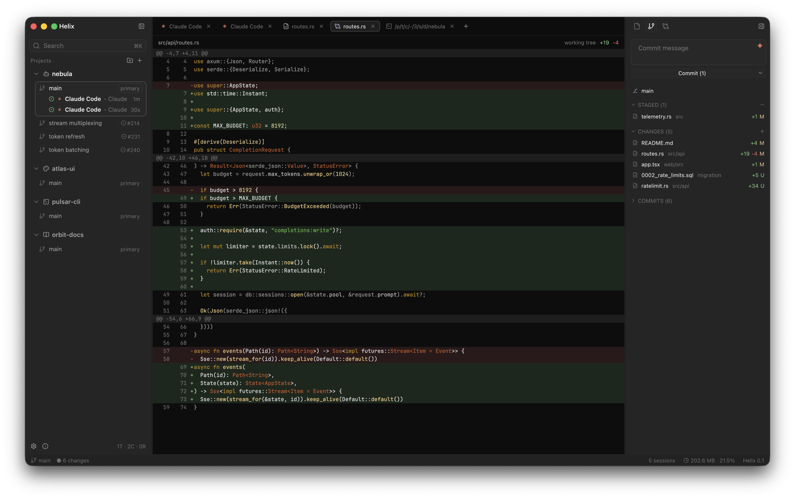
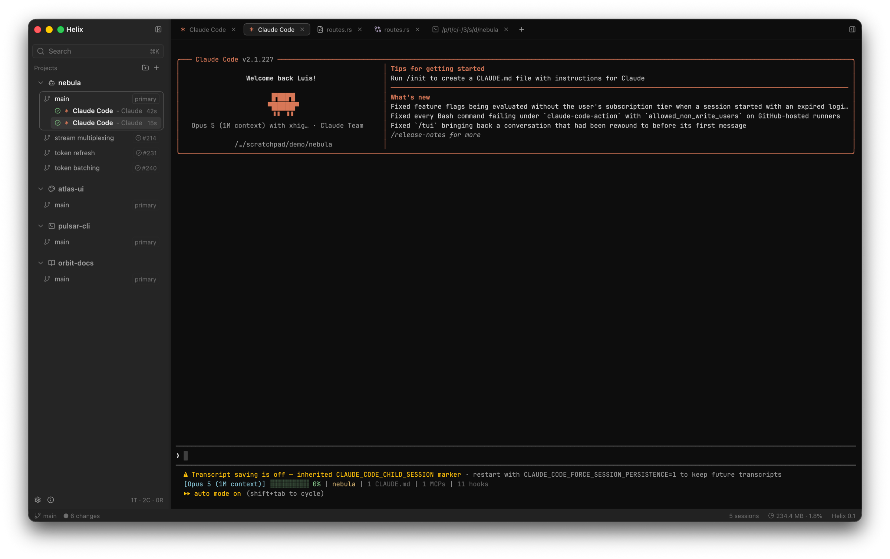

<div align="center">


# Helix

**Um Agent Development Environment nativo, escrito em Rust.**

Cockpit worktree-first para desenvolvimento assistido por IA: cada projeto é ligado a um
worktree do Git, e terminais, sessões do Claude Code, estado do git, diffs e mudanças de
arquivo giram em torno dele — numa janela só.

[](https://www.rust-lang.org)
[](https://www.gpui.rs)
[](#build)
[](#performance)

</div>

<div align="center">
  
  <br />
  <sub>Dois agentes na <code>main</code>, três worktrees esperando, um diff contra a working tree aberto, e a divisão staged/changes/untracked à direita.</sub>
</div>

---

## O que é

Agentes não trabalham um de cada vez, e não trabalham numa branch só. O Helix assume que
a unidade real de trabalho é um **worktree**: uma branch, um diretório, um conjunto de
agentes rodando, um diff, um pull request.

A sidebar da esquerda é a frota — projetos, seus worktrees, e as sessões do Claude Code
rodando dentro de cada um, com status ao vivo. O centro é o workspace — terminais,
editores e diffs como abas. A direita é o contexto — árvore de arquivos, controle de
versão, e o pull request da branch atual.

Sem Electron, sem webview, sem enxame de language servers. Uma janela renderizada na GPU
sobre `libgit2`, um PTY de verdade e a CLI do `gh`.

## Recursos

### Worktrees e projetos

- Projetos são adicionados uma vez e alternados com `⌃1…9`; cada um guarda sua própria
  sessão de abas, restaurada no próximo launch
- Worktrees vinculados são descobertos do próprio git e listados sob o projeto, com
  branch, ahead/behind e estado de review por worktree
- Criação de worktree pelo app: escolha uma branch nova ou existente, ou **deixe o Claude
  nomear a branch** a partir de uma descrição de uma linha do trabalho
- Adote worktrees que já existem em disco, rotule com um nome de exibição, e anexe o
  número de uma issue ou PR do GitHub

### Agentes

- Toda aba `✦ Claude` sobe a CLI `claude` no próprio PTY e é rastreada como um agente
- O status vem da atividade do PTY — Running, Thinking, Waiting, Idle, Finished, Error — e
  sobe para a linha do worktree, então uma olhada na sidebar já diz qual branch ainda
  precisa de você
- Agentes são agrupados por worktree, então várias branches ficam em voo ao mesmo tempo

### Editor e diff

- Abas guardam terminais, editores ou diffs, com a semântica de preview do VS Code: um
  clique abre uma aba de preview substituível, clique duplo fixa
- Syntax highlighting com tree-sitter, números de linha, auto-indent, indent guides, busca
  no buffer; `⌘S` salva
- **Buffers à prova de agente**: um editor limpo recarrega quando um agente reescreve o
  arquivo em disco; um sujo nunca recarrega — ele levanta um banner *Reload from disk /
  Keep my edits*, decidido comparando assinaturas de conteúdo FNV-1a em vez de um timer de
  eco de escrita
- Diffs contra quatro bases — working tree, index, HEAD, merge-base — computados a partir
  de pares de blobs do git com `similar` e renderizados linha a linha com highlighting de
  verdade dos dois lados
- Arquivos acima de 50 MB, binários (sonda de NUL nos primeiros 8 KB) e imagens ganham
  visualizadores dedicados em vez do editor

### Controle de versão

- Árvore de arquivos com status do git por arquivo, propagado aos diretórios ancestrais
  por dominância
- Stage, unstage, discard, stage-all, commit — tudo via `libgit2`, nunca por subprocesso
- **Mensagens de commit escritas pelo Claude** a partir do diff staged, com truncamento
  water-fill para que um diff grande ainda caiba no prompt
- Push, force push, fetch, publish branch, fast-forward, rebase, commit & sync

### Pull requests

- Lookup por branch, rollup de checks com status individual, decisão de review, estado de
  conflito e prontidão para merge, tudo pela CLI do `gh`
- Um botão só toca a máquina de estados: instalar `gh` → autenticar → commitar →
  publicar → push → sync → criar PR → merge
- Um lookup que falha vira `Unavailable`, nunca "não tem PR" — assim nunca é possível
  abrir um duplicado

### Terminal

- Emulação completa via `alacritty_terminal` sobre um PTY nativo: cores ANSI, scrollback,
  seleção, eventos de mouse, copy/paste, resize, drop de arquivo
- Usa seu login shell (fish, zsh, bash…) detectado por `getpwuid`, com fallback para
  `$SHELL`

## Sessões de agente

<div align="center">
  
  <br />
  <sub>Claude Code num PTY de verdade, uma aba por sessão, cada uma rastreada na sidebar com seu próprio status e tempo decorrido.</sub>
</div>

## Build

Requisitos:

- Rust **1.85+** (edition 2024)
- macOS — Linux e Windows estão planejados
- **Command Line Tools** do Xcode bastam: a feature `runtime_shaders` do GPUI está ligada,
  então o Xcode completo não é necessário
- Opcional: [`gh`](https://cli.github.com) para pull requests, `claude` para sessões de
  agente

```sh
git clone <este-repo> helix
cd helix
cargo build --release
```

### Rodando

```sh
cargo run -- /caminho/do/projeto      # sem argumento, usa o diretório atual
```

Ou com [`just`](https://github.com/casey/just):

| Receita | O que faz |
| --- | --- |
| `just run` | perfil `fast` — codegen de release, sem fat LTO |
| `just run-release` | build de release completo |
| `just build` | só o binário de release |
| `just check` | `cargo check --workspace` |
| `just bundle` | gera `target/Helix.app` |
| `just release` | empacota e abre o app |

O perfil `fast` existe porque um relink de release custa um passe de otimização do
programa inteiro a cada mudança; ele mantém codegen de release sem esse custo.

### Bundle macOS

Ícone no Dock e no Finder exige um `.app` de verdade. Coloque um PNG quadrado de
1024×1024 em `assets/icon.png` e rode:

```sh
./scripts/bundle-mac.sh                     # gera target/Helix.app
open target/Helix.app --args /caminho/do/projeto
```

Os tamanhos pré-renderizados em `assets/icon.iconset/` são usados como estão; sem esse
diretório o script reduz o `icon.png` com `sips`, o que fica visivelmente mais borrado em
16px.

`ICON`, `ICONSET`, `BUNDLE_ID`, `PROFILE` (`release`/`debug`), `SIGN` e `BUILD`
sobrescrevem os padrões. `BUILD=0` empacota o que já estiver em `target/`.

O ícone e o nome vêm ambos do `Info.plist` (`CFBundleIconFile`, `CFBundleName`) — não há
código em runtime para nenhum dos dois. `cargo run` continua funcionando, mas produz um
binário solto, então o macOS cai no nome do executável e num ícone genérico.

O bundle é assinado ad-hoc, não notarizado: funciona na máquina que compilou, bloqueado
pelo Gatekeeper em qualquer outra.

### Loop de desenvolvimento

`scripts/dev.sh` usa o [cargo-watch](https://github.com/watchexec/cargo-watch) para
rebuildar, reempacotar e relançar a cada mudança em `src/` ou `assets/`:

```sh
./scripts/dev.sh /caminho/do/projeto    # sem argumento, usa o próprio repo
```

O `cargo watch` é dono do build e encadeia no bundler com `BUILD=0`, então nada compila
duas vezes. Ele roda o `.app` em vez do binário solto, e é por isso que o ícone e o nome
são idênticos em desenvolvimento e em release. Empacotar custa ~0,2s em cima do rebuild: o
`.icns` é reaproveitado a menos que a arte tenha mudado, e a assinatura é pulada.

### Configuração

O estado vive em `~/Library/Application Support/helix/config.json` — projetos, rótulos de
worktree, fonte do terminal, nível de blur e a sessão de abas por projeto. Defina
`HELIX_CONFIG_DIR` para apontar uma execução descartável para outro lugar; o lock de
instância única acompanha, então uma instância de demo roda ao lado da sua real.

## Atalhos

| Tecla | Ação |
| --- | --- |
| `⌘T` | Nova aba de terminal |
| `⌘⇧T` | Nova sessão do Claude Code |
| `⌘W` | Fechar aba ativa |
| `⌘S` | Salvar arquivo (abas de editor) |
| `⌘1…9` | Ativar aba pela posição |
| `⌃1…9` | Trocar de projeto pela posição |
| `⌃Tab` / `⌘⇧]` | Próxima aba |
| `⌃⇧Tab` / `⌘⇧[` | Aba anterior |
| `⌘B` | Alternar sidebar esquerda |
| `⌘L` | Alternar sidebar direita |
| `⌘K` / `⌘P` | Busca |
| `⌘,` | Configurações |
| `⌘C` / `⌘V` | Copiar / colar no terminal |

## Performance

Performance é a primeira restrição, não um passe posterior. CPU em idle perto de zero,
sem travar a UI thread, memória limitada, binário pequeno.

- Qualquer coisa que possa bloquear — IO de arquivo, `git2`, subprocessos — roda no
  background executor e é aplicada de volta por um update
- `render()` é somente leitura e leve em alocação: sem syscalls, sem `read_dir`, sem git2,
  sem clones profundos. As linhas são pré-computadas quando o snapshot chega, não na hora
  de desenhar
- Nada notifica ou anima por timer sem motivo; todo `cx.notify()` reconstrói a árvore de
  elementos da janela, então rajadas são coalescidas em vez de repassadas
- Caches têm política de evicção, o scrollback tem teto, listas longas são virtualizadas
  com `uniform_list`, e o renderizador de diff corta em 120k linhas / 6M chars

## Arquitetura

Um workspace Cargo com um crate por assunto. Crates de UI dependem dos crates de domínio,
nunca o contrário — nenhum crate de domínio depende de `gpui`. Se uma decisão continuaria
verdadeira numa execução headless, ela vive num crate de domínio, atrás de um nome, com
testes.

```
helix/
  assets/      ícone do app: fonte svg, png 1024, iconset pré-renderizado
  scripts/     loop de dev, bundler macOS, estatísticas de perf
  src/
    app/         binário: bootstrap da janela, lock de instância, blur e ícone no macOS
    ui/          views GPUI: layout, sidebars, workspace, terminal/editor/diff, tema
    terminal/    PTY + backend alacritty_terminal (sem dependência de UI)
    agents/      specs de launch, transporte da CLI do Claude, branches, commits
    buffer/      leitura de arquivo com corte por tamanho/binário, linguagem, assinaturas
    git/         snapshots libgit2, ops de index, diffs por par de blobs, ops de remote
    github/      transporte da CLI gh, modelo de review, máquina de estados de PR
    worktree/    descoberta e criação de projeto/worktree, listagem de branches
    filesystem/  watcher recursivo de fs com debounce
    events/      tipos de evento e canais compartilhados
    models/      tipos de domínio puros compartilhados por todos os crates
    state/       config, status de atividade de sessão, log de histórico
    commands/    actions do gpui e keybindings padrão
```

## Roadmap

* **Comandos por projeto e worktree** — comandos nomeados (`dev`, `migrate`, `seed`)
  salvos no projeto ou na worktree, disparados com um clique num terminal novo, mais
  ganchos de `setup` na criação e `destroy` antes da remoção
* **Abas lado a lado** — árvore de panes com split horizontal/vertical no lugar da lista
  plana de abas, com o layout persistido na sessão
* **Keybinds configuráveis** — keymap no config, editável pela UI, com detecção de
  conflito e reset ao padrão
* **Sistema de temas** — temas embutidos e customizados, aplicados ao app e à paleta ANSI
  do terminal
* **Sidebar redesenhada** — nova hierarquia visual e extração da regra de domínio que hoje
  mora em `helix-ui`
* **CI e release por GitHub Actions** — build assinado com Developer ID e notarizado,
  publicado a partir de uma tag
* **Auto updater** — checagem em background, notas de release e troca do `.app` sem
  reinstalar na mão
* **Estudo: `alacritty_terminal` → `libghostty`** — spike de custo de build, ganho real e
  impacto no `helix-terminal`
* **CLI de controle** — um `helix` de linha de comando com esquema de comandos legível por
  máquina, para um agente criar worktree, abrir arquivo, abrir diff e subir terminal
  dentro do app que já está rodando
* **Terminal como API** — listar sessões, ler saída limitada, enviar input e esperar por
  condição (processo saiu, sessão ociosa); é a base de qualquer orquestração séria entre
  agentes
* **Contas gerenciadas** — várias contas do Claude Code no host, escolhidas por projeto ou
  por worktree
* **Confirmação de edições não salvas** — fechar aba, fechar janela e sair passam a
  perguntar em vez de descartar calados
* **Busca de arquivos e de conteúdo** — fuzzy finder sobre a worktree respeitando o
  `.gitignore`, e busca por conteúdo que abre o resultado na linha certa
* **Ações na árvore de arquivos** — criar, renomear, duplicar, deletar, revelar no Finder e
  copiar caminho, direto pelo menu de contexto
* **Find & replace e ir para linha** — substituição no buffer com regex e ocorrências, e
  `⌃G` para pular para uma linha
* **Command palette** — todas as ações registradas em `helix-commands`, filtráveis, com o
  atalho efetivo de cada uma
* **Trocar de branch pela UI** — listar branches, fazer checkout e criar branch sem ir pro
  terminal
* **Mais configurações** — editor, terminal, arquivos, git e agentes; hoje quase tudo é
  constante no código
* **Zoom de fonte** — `⌘+` / `⌘−` / `⌘0` no painel em foco, com reflow do PTY
* **Reordenar abas** — arrastar para mudar a ordem, e mover entre panes quando o split
  existir
